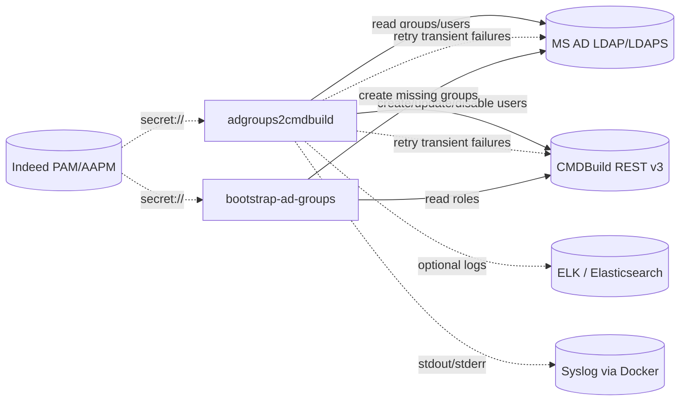

# Архитектурные артефакты ad2cmdb

`ad2cmdb` синхронизирует группы Microsoft Active Directory с учетными записями и группами CMDBuild.
Основной компонент `adgroups2cmdbuild` работает как периодический микросервис.
Разовая подготовка групп AD вынесена в отдельный deployment tool `bootstrap-ad-groups`.

## Артефакты

| Файл | Назначение |
| --- | --- |
| [business-process.md](business-process.md) | Бизнес-процессы синхронизации, блокировки и bootstrap AD-групп |
| [configuration-files.md](configuration-files.md) | Карта конфигурационных файлов, env overrides и state |
| [contracts/operational-api.openapi.json](contracts/operational-api.openapi.json) | OpenAPI contract для `/health`, `/ready`, `/sync/status` |
| [deployment.md](deployment.md) | Развертывание сервиса, Docker, ports, smoke и rollback |
| [information-model.md](information-model.md) | Информационные сущности, ключи и правила владения данными |
| [modernization-backlog.md](modernization-backlog.md) | Текущий modernization baseline, закрытые P1 gaps и backlog |
| [test-coverage.md](test-coverage.md) | Карта покрытия автотестами, ручными smoke checks и remaining external coverage |
| [maps/access-map.md](maps/access-map.md) | Внешние подключения и минимальные права |
| [maps/healthcheck-map.md](maps/healthcheck-map.md) | Health/status endpoints и операционные проверки |
| [maps/observability-map.md](maps/observability-map.md) | Console, ELK, Docker syslog и debug-level logging |
| [maps/secrets-map.md](maps/secrets-map.md) | Секреты, PAM/AAPM ссылки и runtime-поля |
| [monitoring/README.md](monitoring/README.md) | Zabbix и Prometheus/Grafana artifacts для monitoring rollout |

## Контекст

## Принципы

- Source of truth для членства пользователей в группах - MS AD.
- CMDBuild roles должны иметь те же имена, что и управляемые AD groups.
- `ProvisioningGroupName` означает право пользователя иметь активную УЗ в CMDBuild.
- Разовая подготовка AD groups не встроена в сервис и запускается явно оператором.
- По умолчанию опасные действия выключены: sync работает в `DryRun=true`, bootstrap tool работает без `--apply`.
- Секреты не хранятся в git: используются env, mounted config или PAM/AAPM `secret://...`.
- Transient ошибки AD/CMDBuild повторяются с bounded exponential backoff и jitter.
- Health/readiness/status API имеет машинный OpenAPI contract для contract tests и внешней документации.
- Zabbix и Prometheus/Grafana monitoring artifacts поставляются как архитектурные артефакты.
- При остановке сервиса активный sync-run завершается штатно в пределах `Sync:ShutdownGracePeriodSeconds` либо отменяется с фиксацией ошибки в status.
